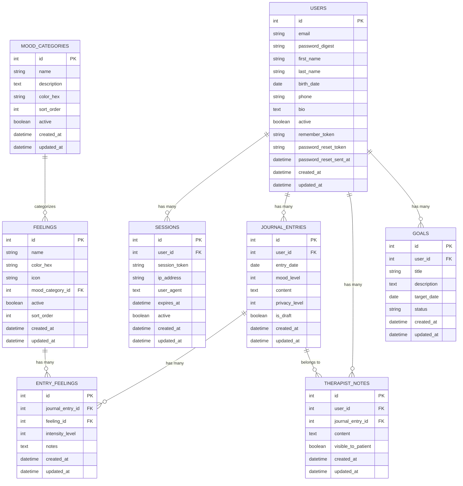

# 🗃️ Diagrama de Entidades - Mental Journal

## Diagrama de Relacionamento das Entidades



## 📋 Descrição dos Relacionamentos

### 1. Users (1:N) → Sessions
- Um usuário pode ter múltiplas sessões ativas
- Permite login em múltiplos dispositivos
- Controle de expiração e segurança

### 2. Users (1:N) → Journal_Entries
- Um usuário pode ter múltiplas entradas de diário
- Cada entrada pertence a apenas um usuário
- Constraint: apenas uma entrada por usuário por dia

### 3. Journal_Entries (1:N) → Entry_Feelings
- Uma entrada pode ter múltiplos sentimentos associados
- Permite intensidade e notas específicas para cada sentimento

### 4. Feelings (N:1) → Mood_Categories
- Cada sentimento pertence a uma categoria
- Categorias ajudam na organização e análise

### 5. Users (1:N) → Goals
- Um usuário pode ter múltiplos objetivos terapêuticos
- Permite acompanhamento de progresso

### 6. Users + Journal_Entries (1:N) → Therapist_Notes
- Notas do terapeuta podem ser gerais (só user_id) ou específicas (journal_entry_id)
- Controle de visibilidade para o paciente

## 🔍 Índices Recomendados

```sql
-- Índices para performance
CREATE INDEX idx_users_email ON users(email);
CREATE INDEX idx_sessions_user_id ON sessions(user_id);
CREATE INDEX idx_sessions_token ON sessions(session_token);
CREATE INDEX idx_journal_entries_user_id ON journal_entries(user_id);
CREATE INDEX idx_journal_entries_date ON journal_entries(entry_date);
CREATE INDEX idx_journal_entries_user_date ON journal_entries(user_id, entry_date);
CREATE INDEX idx_entry_feelings_journal_id ON entry_feelings(journal_entry_id);
CREATE INDEX idx_entry_feelings_feeling_id ON entry_feelings(feeling_id);
CREATE INDEX idx_feelings_category ON feelings(mood_category_id);
CREATE INDEX idx_goals_user_id ON goals(user_id);
CREATE INDEX idx_therapist_notes_user_id ON therapist_notes(user_id);
CREATE INDEX idx_therapist_notes_entry_id ON therapist_notes(journal_entry_id);
```

## 🎯 Constraints e Validações

### Constraints de Banco
```sql
-- Constraint única para email
ALTER TABLE users ADD CONSTRAINT unique_email UNIQUE (email);

-- Constraint única para entrada por dia por usuário
ALTER TABLE journal_entries ADD CONSTRAINT unique_user_entry_date UNIQUE (user_id, entry_date);

-- Constraint única para token de sessão
ALTER TABLE sessions ADD CONSTRAINT unique_session_token UNIQUE (session_token);

-- Constraint para mood_level entre 1 e 10
ALTER TABLE journal_entries ADD CONSTRAINT check_mood_level CHECK (mood_level BETWEEN 1 AND 10);

-- Constraint para intensity_level entre 1 e 5
ALTER TABLE entry_feelings ADD CONSTRAINT check_intensity CHECK (intensity_level BETWEEN 1 AND 5);
```

### Validações de Model (Rails)
```ruby
# User
validates :email, presence: true, uniqueness: true, format: { with: URI::MailTo::EMAIL_REGEXP }
validates :password, length: { minimum: 8 }, confirmation: true

# JournalEntry
validates :user_id, presence: true
validates :entry_date, presence: true, uniqueness: { scope: :user_id }
validates :mood_level, inclusion: { in: 1..10 }

# EntryFeeling
validates :intensity_level, inclusion: { in: 1..5 }
validates :journal_entry_id, :feeling_id, presence: true

# Session
validates :session_token, presence: true, uniqueness: true
validates :user_id, presence: true
```

## 📊 Queries Comuns

### 1. Dashboard - Últimas entradas do usuário
```sql
SELECT je.*, COUNT(ef.id) as feelings_count
FROM journal_entries je
LEFT JOIN entry_feelings ef ON ef.journal_entry_id = je.id
WHERE je.user_id = ? AND je.entry_date >= ?
GROUP BY je.id
ORDER BY je.entry_date DESC
LIMIT 10;
```

### 2. Gráfico de humor - Últimos 30 dias
```sql
SELECT entry_date, mood_level
FROM journal_entries
WHERE user_id = ? AND entry_date >= DATE('now', '-30 days')
ORDER BY entry_date;
```

### 3. Sentimentos mais frequentes
```sql
SELECT f.name, f.color_hex, COUNT(*) as frequency, AVG(ef.intensity_level) as avg_intensity
FROM entry_feelings ef
JOIN feelings f ON f.id = ef.feeling_id
JOIN journal_entries je ON je.id = ef.journal_entry_id
WHERE je.user_id = ? AND je.entry_date >= DATE('now', '-30 days')
GROUP BY f.id, f.name, f.color_hex
ORDER BY frequency DESC
LIMIT 10;
```

### 4. Progresso dos objetivos
```sql
SELECT title, description, target_date, status,
       CASE 
         WHEN target_date < DATE('now') AND status != 'completed' THEN 'overdue'
         WHEN target_date <= DATE('now', '+7 days') THEN 'due_soon'
         ELSE 'on_track'
       END as urgency
FROM goals
WHERE user_id = ? AND status != 'cancelled'
ORDER BY target_date;
```

## 🔄 Migrações Sugeridas

### Ordem de criação:
1. `users`
2. `sessions`
3. `mood_categories`
4. `feelings`
5. `journal_entries`
6. `entry_feelings`
7. `goals`
8. `therapist_notes`

### Seeds iniciais:
- **Mood Categories**: Positivo, Negativo, Neutro, Ansiedade, Energia
- **Feelings**: ~20-30 sentimentos básicos distribuídos pelas categorias
- **Admin User**: Para testes e demonstração
